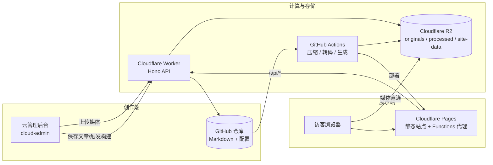
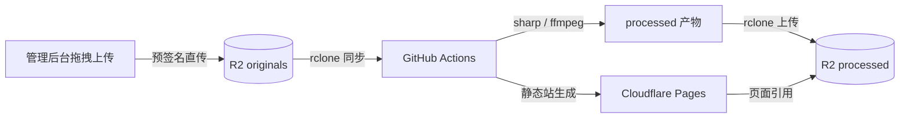

<div align="center">


# Mosaic

**你的个人 B 站 —— 一个以媒体为第一公民的静态站点生成器与内容平台**

Markdown 写故事，照片 / 视频 / 音乐做主角。
0 成本 · 云端管理 · 零运维 · 纯静态 · 开箱即用。

[](https://github.com/YupenBob/mosaic/actions/workflows/pipeline.yml)
[](https://github.com/YupenBob/mosaic/actions/workflows/health-check.yml)
[](#协议)
[](https://mosaic.xsanye.cn)

**English** · [README_EN.md](README_EN.md)

</div>

---

## 是什么

Mosaic 是一个**多媒体优先的静态站点框架**：像 Hexo 一样用 Markdown 写作，但不是"挂 MP4 的博客"——照片画廊、多码率 HLS 视频、音乐播放器生来就是平台的主角。

它把"内容创作 → 媒体处理 → 静态发布 → 数据统计"整条链路做成一个可复用的框架：内容在 Git，媒体在 Cloudflare R2，计算在 GitHub Actions，展示在 Cloudflare Pages，管理在一个零构建的云后台。**未来成百上千用户开箱即用**是每一处设计的出发点。

## 特性一览

### 创作与发布

| 能力 | 说明 |
| --- | --- |
| Markdown 写作 | YAML frontmatter 驱动，布局 / 封面 / 视频模式 / 多级分类随意编排 |
| 媒体原生支持 | 图片、视频、音乐一视同仁，是内容模型的一等公民 |
| 预签名直传 | 浏览器直连 R2 上传（单文件可达 5GB），不再经服务器中转 |
| 媒体管线 | 图片 → WebP 多档、视频 → HLS 多码率、音乐 → MP3 128k/320k，全自动 |
| EXIF 隐私 | 管线自动剥离原图 EXIF（GPS 等），隐私由设计保证 |
| 一键发布 | 管理后台保存 → 构建 → 部署，全程无需命令行 |

### 观看体验

| 能力 | 说明 |
| --- | --- |
| 照片画廊 | 4 档清晰度（480p/720p/1080p/原图）、LQIP 渐进加载、滚轮缩放、胶片导航、切档保留缩放 |
| 视频播放器 | HLS 多码率自适应（ABR）、手动切档、倍速、PiP、画中画、播放列表、致命错误自动恢复 |
| 智能 ABR | 带宽估算起步、按播放器尺寸封顶、切档无缝不断流、Auto 逻辑干净利落 |
| 音乐播放器 | 列表播放、128k/320k 码率、mini 播放器、锁屏媒体会话（Media Session） |
| 搜索与筛选 | 全文搜索、分类 / 标签瀑布流卡片 |
| 暗色模式 / i18n | 跟随系统，中英双语 |
| RSS / Sitemap / 评论 | 自动生成 feed 与站点地图，Giscus 评论开箱即用 |

### 云管理后台

| 能力 | 说明 |
| --- | --- |
| 零构建 SPA | 纯 Vanilla JS，ES Module 化，无框架、无打包步骤 |
| 仪表盘 | 流量曲线、分类/标签真实统计、热门文章、存储用量、系统健康 |
| 构建中心 | 步骤级进度条 + ETA、耗时统计、失败高亮、GitHub 跳转 |
| 编辑器 | Markdown 实时预览、自动保存草稿、封面上传、媒体拖拽上传（并发 + 重试） |
| 站点配置 | 全部配置可视化编辑，含画质档位 / 转码参数 / 主题 / favicon |
| 效率工具 | 命令面板（Ctrl/Cmd+K）、快捷键、三态主题、回收站、危险操作确认 |

### 工程与运维

| 能力 | 说明 |
| --- | --- |
| 增量构建 | 媒体 checksum 缓存 + 产物清单，缓存命中时压缩从分钟级降到秒级 |
| 并发安全统计 | 浏览量/点赞/停留时长由 Durable Object 串行写入，杜绝丢失 |
| 零成本可观测 | 构建进度实时上报、生产健康检查定时巡检、全链路自动化测试 |
| 安全默认 | JWT 鉴权 + 登录限流、上传大小/类型白名单、fail-closed 配置、密钥隔离 |
| 国内可用 | Pages Functions 代理绕过 workers.dev、字体/图表全自托管 |

## 架构



- **Git 仓库**：内容与配置的单一事实来源（`content/posts/*/index.md`、`mosaic.config.json`）
- **R2 对象存储**：`originals/`（原始媒体）→ `processed/`（压缩产物）→ `site-data/`（统计、脏标记、构建进度）
- **GitHub Actions**：同步 → 剥离 EXIF → 压缩/转码 → 生成静态站 → 上传产物 → 部署
- **Worker API**：认证、上传（预签名直传 + 兜底）、文章 CRUD、构建触发与进度、统计（Durable Object）
- **Cloudflare Pages**：前台静态站 + 管理后台，`/api/*` 经 Functions 同源代理到 Worker

## 媒体管线



- 图片：WebP 480p/720p/1080p + 150px LQIP；视频：HLS 多码率（最高 1080p 默认，4K 可配置）+ MP4 兜底；音乐：MP3 128k/320k
- 增量：媒体 MD5 缓存 + 产物清单，未变化的内容在 CI 中直接跳过，构建可稳定控制在 3 分钟内
- 隐私：上传的原始照片自动剥离 EXIF；媒体直连域名通过确定性 CORS 策略保证 HLS 跨域播放

## 快速开始

```bash
git clone https://github.com/YupenBob/mosaic.git
cd mosaic
npm install
npm run compress      # 压缩媒体（本地无媒体可跳过）
npm run build         # 生成静态站点
npm run serve         # 预览 http://localhost:3000
npm run check         # 语法 + config 校验 + worker/build smoke
npm run validate      # 校验 mosaic.config.json 与文章 frontmatter
npm run lint          # ESLint（0 警告）
npm run test:e2e:local# 本地静态预览 E2E（先 npm run build）
```

> 从零到线上（Cloudflare 配置、Secrets、首次部署）见 **[docs/SETUP.md](docs/SETUP.md)**

## 写文章

```
content/posts/my-post/
  ├── index.md       # Markdown + YAML frontmatter
  ├── photos/        # 图片原片
  ├── videos/        # 视频原片
  └── music/         # 音频原片
```

```yaml
---
title: "我的摄影故事"
date: 2026-05-01
category: photography/nature   # 支持多级分类
tags: [风光, 旅行]
description: "一场影像之旅。"
cover: cover.jpg
layout: video-first           # default | video-first | gallery-first
video_mode: stacked           # stacked | playlist
---
```

## 云管理后台

部署在 `mosaic-admin.xsanye.cn`，登录即用。v0.9 起采用 ES Module 架构（每页一个模块），提供仪表盘、文章管理、可视化编辑器、构建中心（步骤级进度 + ETA）、站点配置、分类标签管理、清理与回收站。支持命令面板、键盘快捷键、三态主题与中英双语。

## Worker API

按需认证分组的 REST API（详见 [handover.md](handover.md)）：

- **公开**：`/api/health`、`/api/stats/traffic`、`/api/stats/:slug`、`/api/track/view|like|dwell/:slug`、`/api/media/file/:slug/:filename`
- **需认证**：文章 CRUD 与分页、配置读写、构建触发 / 状态 / 历史 / 进度、分类标签（重命名/删除）、媒体列表与删除、存储用量、孤儿清理、脏标记、批量文章统计

## 性能与可靠性设计

- **统计并发**：视图/点赞/停留时长写入 Durable Object 串行化，迁移自 R2 历史数据
- **构建缓存**：媒体 checksum 缓存 + 产物清单，缓存命中构建 ≈ 3 分钟；视频仅在真正变更时重转码
- **上传直达**：预签名 URL 让浏览器直连 R2，绕开 Worker 中转与平台 100MB 限制
- **播放可靠**：HLS 直连 + 确定性 CORS；ABR 按带宽与播放器尺寸自适应，超时重试与自动恢复
- **自动化守护**：管线内置单元/冒烟测试；每 6 小时生产健康巡检，异常即告警

## 项目结构

```
├── content/posts/            # 文章（Markdown + 媒体原片，Git 管理文本）
├── scripts/                  # 构建脚本：compress / generate / upload / build-progress
├── src/                      # 前台模板（EJS）与前端资源
│   ├── layouts/              #   index / post / 404 模板
│   ├── assets/js/            #   gallery / video / music / search / filter ...
│   ├── assets/css/           #   设计令牌与组件样式
│   └── data/                 #   i18n 词典
├── worker/                   # Cloudflare Worker API（Hono + DO）
│   ├── src/                  #   index / auth / github / r2 / stats-do
│   └── scripts/              #   元数据迁移与 SDK 视频上传器
├── cloud-admin/              # 云管理后台（零构建 Vanilla JS SPA）
├── functions/                # 前台 Pages Functions 代理
├── tests/                    # E2E / 冒烟测试（Playwright + Node）
├── docs/                     # 架构 / 配置 / 媒体 / 音乐 / 迁移 / 搭建文档
├── mosaic.config.json        # 站点配置
└── .github/workflows/        # pipeline（构建部署）+ health-check（巡检）
```

## 部署

1. 配置 Cloudflare（R2 桶 + Pages 项目 + Worker）
2. 部署 Worker：`cd worker && npx wrangler deploy`
3. 部署管理后台：`npx wrangler pages deploy cloud-admin --project-name mosaic-admin`
4. 配置 GitHub Actions Secrets（R2 凭证、CF 令牌、Worker Secrets）
5. Push 到 `main` → 管线自动构建、压缩、部署

完整步骤与秘钥清单见 **[docs/SETUP.md](docs/SETUP.md)**。

## 文档

- [架构设计](docs/architecture.md)
- [站点配置](docs/configuration.md)
- [媒体指南](docs/media-guide.md)
- [音乐指南](docs/music-guide.md)
- [迁移指南](docs/migration.md)
- [交接文档](handover.md)

## 路线图

- [ ] 媒体域 Transform Rule：恢复边缘缓存的同时保证 CORS（视频播放延迟进一步下降）
- [ ] 音乐播放器波形可视化（waveform 数据管线）
- [ ] 移动端真机 HLS 兼容矩阵（iOS Safari / Android Chrome）
- [x] 管理后台构建页合并为单视图（概览/状态/历史同屏、实时轮询、失败定位）
- [ ] 构建页持续打磨（交互细节与可访问性）
- [x] 上传器并发提升与断点续传（>100MB 自动分片，3 并发 + 每片重试 + 断点续传）

## 协议

[MIT](LICENSE) © Mosaic Contributors
