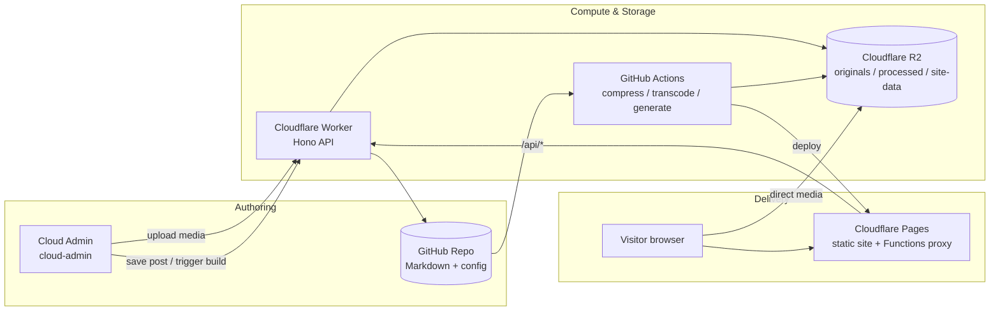
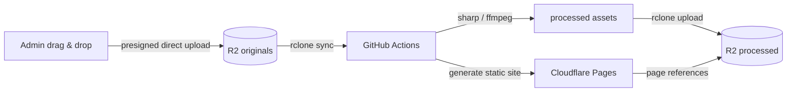

<div align="center">


# Mosaic

**Your personal B-station — a media-first static site framework and content platform**

Write stories in Markdown. Let photos, videos, and music take the lead.
Zero cost · Cloud management · Zero ops · Pure static · Ready out of the box.

[](https://github.com/YupenBob/mosaic/actions/workflows/pipeline.yml)
[](https://github.com/YupenBob/mosaic/actions/workflows/health-check.yml)
[](#license)
[](https://mosaic.xsanye.cn)

**简体中文** · [README.md](README.md)

</div>

---

## What is it

Mosaic is a **media-first static site framework**: write like Hexo, but it is not a "blog that embeds MP4s". Photo galleries, multi-bitrate HLS video, and a music player are first-class citizens.

It turns the whole chain — content authoring, media processing, static publishing, and analytics — into a reusable framework: content in Git, media in Cloudflare R2, compute in GitHub Actions, display on Cloudflare Pages, and management in a build-free cloud console. **Designed from day one for hundreds of users to use out of the box.**

## Features

### Authoring & Publishing

| Capability | Description |
| --- | --- |
| Markdown authoring | YAML frontmatter drives layout, cover, video mode, multi-level categories |
| First-class media | Images, videos, and music are equal citizens of the content model |
| Presigned direct upload | Browser uploads straight to R2 (up to 5GB per file), no server relay; files >100MB use resumable multipart (concurrent parts, per-part retry, resume) |
| Media pipeline | Images → multi-tier WebP, video → multi-bitrate HLS, music → MP3 128k/320k + waveform peaks, fully automatic |
| EXIF privacy | Pipeline strips EXIF (GPS etc.) from original photos by design |
| One-click publish | Save → build → deploy from the admin console, no CLI needed |

### Viewing Experience

| Capability | Description |
| --- | --- |
| Photo gallery | 4 quality tiers (480p/720p/1080p/original), LQIP progressive loading, wheel zoom, filmstrip, zoom kept across quality switches |
| Video player | HLS adaptive bitrate (ABR), manual quality switch, speed, PiP, playlist, fatal-error auto recovery |
| Smart ABR | Bandwidth-based start, player-size capping, seamless switching, clean Auto logic |
| Music player | Track list, 128k/320k streams, mini player, Media Session, background persistence |
| Search & filter | Full-text search, category/tag masonry cards |
| Dark mode / i18n | System-following theme, Chinese & English |
| RSS / Sitemap / Comments | Auto feeds, sitemap, Giscus comments |

### Cloud Admin

| Capability | Description |
| --- | --- |
| Build-free SPA | Pure Vanilla JS, ES modules, no framework or build step |
| Dashboard | Traffic chart, real taxonomy stats, leaderboard, storage, health |
| Build center | Step-level progress + ETA, timing, failure highlight, GitHub links |
| Editor | Live Markdown preview, autosave drafts, cover picker, drag-drop upload (concurrent + retry) |
| Site config | All settings editable, including quality tiers and transcode params |
| Productivity | Command palette (Ctrl/Cmd+K), shortcuts, 3-state theme, trash, confirmations |

### Engineering & Ops

| Capability | Description |
| --- | --- |
| Incremental builds | Media checksum cache + manifest: compression drops from minutes to seconds on cache hits |
| Race-free stats | Views/likes/dwell serialized by a Durable Object |
| Zero-cost observability | Build progress reporting, scheduled production health checks, full CI tests |
| Secure by default | JWT + login rate limit, global per-IP track rate limit (Durable Object), upload size/type allowlist, fail-closed config, secret isolation |
| China-friendly | Pages Functions proxy bypasses workers.dev; self-hosted fonts and Chart.js |

## Architecture



- **Git repo**: single source of truth for content and config
- **R2 storage**: `originals/` → `processed/` → `site-data/` (stats, dirty flag, build progress)
- **GitHub Actions**: sync → EXIF strip → compress/transcode → generate → upload → deploy
- **Worker API**: auth, upload (presigned + fallback), post CRUD, build trigger/progress, stats (Durable Object)
- **Cloudflare Pages**: frontend + admin, `/api/*` proxied same-origin to the Worker

## Media pipeline



- Images: WebP 480p/720p/1080p + 150px LQIP; video: multi-bitrate HLS (1080p default, 4K configurable) + MP4 fallback; music: MP3 128k/320k
- Incremental: MD5 cache + asset manifest keeps cache-hit builds around 3 minutes
- Privacy: EXIF stripped from originals; deterministic CORS keeps HLS playback reliable

## Quick Start

```bash
git clone https://github.com/YupenBob/mosaic.git
cd mosaic
npm install
npm run compress      # compress media (skip if no local media)
npm run build         # generate the static site
npm run serve         # preview at http://localhost:3000
```

> Full zero-to-live guide: **[docs/SETUP.md](docs/SETUP.md)**

## Writing a Post

```
content/posts/my-post/
  ├── index.md       # Markdown + YAML frontmatter
  ├── photos/        # original images
  ├── videos/        # original videos
  └── music/         # original audio
```

```yaml
---
title: "My Photo Story"
date: 2026-05-01
category: photography/nature   # multi-level supported
tags: [landscape, travel]
description: "A photo journey."
cover: cover.jpg
layout: video-first           # default | video-first | gallery-first
video_mode: stacked           # stacked | playlist
---
```

## Cloud Admin

Deployed at `mosaic-admin.xsanye.cn`, log in with the admin password. Since v0.9 the console is an ES-module SPA with dashboard, post management, a visual editor, a build center (step-level progress + ETA), site settings, taxonomy management, cleanup, and trash. Includes a command palette, keyboard shortcuts, a 3-state theme, and Chinese/English UI.

## Worker API

Auth-grouped REST endpoints (see [handover.md](handover.md) and [docs/api.md](docs/api.md)):

- **Public**: health, stats/traffic, stats/:slug, track/view|like|dwell, media/file
- **Auth**: posts CRUD + pagination, config read/write, build trigger/status/history/progress, taxonomy (rename/delete), media list/delete, upload (presign/complete/direct), bulk post stats, disk, cleanup, processed-cache, dirty, trash

## Performance & Reliability

- **Race-free stats**: Durable Object serialized writes, migrated from R2 history
- **Build caching**: checksum cache + asset manifest; cache-hit builds ≈ 3 minutes; transcodes only on real media changes
- **Direct uploads**: presigned URLs take the browser straight to R2, bypassing Worker relay and the 100MB platform limit
- **Reliable playback**: HLS direct + deterministic CORS; ABR adapts to bandwidth and player size with retry and auto recovery
- **Automated guards**: unit/smoke tests in the pipeline; production health check every 6 hours

## Project Structure

```
├── content/posts/            # posts (Markdown text managed by Git)
├── scripts/                  # compress / generate / upload / build-progress
├── src/                      # frontend templates (EJS) and assets
│   ├── layouts/              #   index / post / 404
│   ├── assets/js/            #   gallery / video / music / search / filter ...
│   ├── assets/css/           #   design tokens and components
│   └── data/                 #   i18n
├── worker/                   # Cloudflare Worker API (Hono + DO)
│   └── scripts/              #   metadata migration / SDK video uploader
├── cloud-admin/              # build-free Vanilla JS SPA admin
├── functions/                # frontend Pages Functions proxy
├── tests/                    # E2E / smoke tests (Playwright + Node)
├── docs/                     # architecture / config / media / music / testing / ops
├── mosaic.config.json        # site config
└── .github/workflows/        # pipeline (build/deploy) + health-check
```

## Deploy

1. Configure Cloudflare (R2 bucket + Pages projects + Worker)
2. Deploy Worker: `cd worker && npx wrangler deploy`
3. Deploy admin: `npx wrangler pages deploy cloud-admin --project-name mosaic-admin`
4. Configure GitHub Actions secrets (R2 credentials, CF token, Worker secrets)
5. Push to `main` → the pipeline builds, compresses, and deploys automatically

See **[docs/SETUP.md](docs/SETUP.md)** for details.

## Documentation

- [Architecture](docs/architecture.md)
- [Configuration](docs/configuration.md)
- [API Reference](docs/api.md)
- [Admin Guide](docs/admin.md)
- [Media Guide](docs/media-guide.md)
- [Music Guide](docs/music-guide.md)
- [Testing Guide](docs/testing.md)
- [Operations](docs/operations.md)
- [Migration](docs/migration.md)
- [Handover](handover.md)

## Roadmap

- [ ] Media-domain Transform Rule: restore edge caching while keeping CORS stable
- [x] Music waveform visualization (peaks generated by the pipeline, canvas renderer with click-to-seek)
- [x] Mobile HLS automation matrix (Chromium/WebKit × phone viewports)
- [ ] Real-device HLS verification (iOS Safari / Android Chrome, manual)
- [x] Admin build page merged into a single view (overview/status/history + live polling)
- [ ] Further admin build-page polish (interaction details & accessibility)
- [x] Concurrent/resumable uploads (>100MB multipart, 3-way concurrency, per-part retry, resume)

## License

[MIT](LICENSE) © Mosaic Contributors
