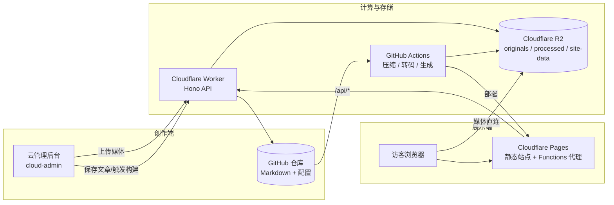

# Mosaic v1.0 架构

## 总览

Mosaic 是一个**媒体优先**的纯静态站点框架：内容在 Git、媒体在 Cloudflare R2、计算在 GitHub Actions、展示在 Cloudflare Pages、管理在零构建的云后台。所有设计以"未来成百上千用户开箱即用"为出发点。



## 分层

### 1. Git 仓库（内容层）

只存文本内容：
- `content/posts/{slug}/index.md` —— Markdown + YAML frontmatter
- `mosaic.config.json` —— 站点配置（可在 Admin 后台编辑）
- `src/layouts/`、`src/assets/`、`src/data/` —— 模板、资源、i18n
- `themes/`、`scripts/`、`worker/`、`cloud-admin/`、`tests/` —— 主题、构建、API、后台、测试

**不存放**图片/视频/音频等二进制媒体（由 `.gitignore` 排除）。

### 2. Cloudflare R2（媒体层）

- `originals/{slug}/photos|videos|music/` —— 原始媒体（上传后由管线剥离 EXIF）
- `processed/{slug}/photos|videos|music|covers/` —— 压缩产物（WebP 多档、HLS+MP4、MP3）
- `site-data/` —— 运行时数据：`stats.json`（统计，DO 备份）、`dirty.json`（脏标记）、`posts.json`（文章列表缓存）、`build-progress.json`（构建进度）、`media-usage.json`（用量快照）、`favicon.*`

媒体由自定义域名 `mosaic-media.xsanye.cn` 直连提供（`` 等不需要 CORS 的资源直连；HLS 由 Worker 代理保证确定性 CORS 或依赖桶级 CORS 配置，见 [operations.md](operations.md)）。

### 3. GitHub Actions（计算层）

`pipeline.yml` 在 push 或 workflow_dispatch 时执行：

1. 校验配置与 frontmatter（`npm run validate`）；恢复媒体 checksum 缓存（`actions/cache`）
2. 同步 `originals/` → `content/posts/`，exiftool 剥离原图 EXIF
3. `compress.js`：图片 WebP（480/720/1080 + LQIP）、视频 HLS+MP4（240p–1080p，4K 可配）、音乐 MP3（128k/320k），并把**产物清单**写回 checksums（缓存命中时跳过转码、generate 仍能拿到档位信息）
4. `generate.js`：Markdown → 静态 HTML + RSS/Sitemap + 前端数据
5. 测试：`npm run check`（语法 + proxy 同步 + worker/build smoke）、`npm run lint`、`npm run format:check`、Playwright 本地静态预览 E2E
6. 上传 processed（rclone）+ 视频媒体（SDK 上传器，`Cache-Control: public, max-age=31536000` + 正确 Content-Type）
7. 剥离后的 originals 回传 R2
8. `minify.js`（esbuild）压缩 `dist/assets` 前端资源（保留 ESM import）；剥离 `dist` 媒体目录并拷贝 Functions
9. `wrangler pages deploy` 部署前台

另有 `health-check.yml` 每 6 小时对线上域名跑一遍 `check-site.mjs`，失败即告警。

### 4. Cloudflare Pages（展示层）

- 前台静态站（`mosaic.xsanye.cn`）：HTML/CSS/JS（构建时 esbuild 压缩）+ JSON 数据 + RSS/Sitemap，媒体引用 R2 URL
- 管理后台（`mosaic-admin.xsanye.cn`）：零构建 Vanilla JS SPA
- 两者都带 `functions/api/[[path]].js`，把 `/api/*` 同源代理到 Worker，并用 HMAC-SHA256 签名真实访客 IP（`X-Mosaic-Proxy-IP/Time/Sig`，见 [operations.md](operations.md)）；两份代理由 `shared/pages-proxy.mjs` 经 `scripts/sync-proxy.mjs` 同步生成

### 5. Worker API（API 层）

基于 Hono，位于 `mosaic-api.xsanye.cn`：

- **认证**：JWT（`POST /api/auth/login`），`ADMIN_PASSWORD`/`JWT_SECRET` 未配置时 fail-closed；登录失败限流（5 次/5 分钟/IP）
- **上传**：预签名直传（`/api/upload/presign` → 浏览器 PUT R2 → `/api/upload/complete` 确认并标脏）为主，`/api/upload/direct`（≤100MB）兜底
- **内容**：文章 CRUD + 分页、配置读写（深合并）、GitHub Actions 构建触发（workflow_dispatch，回退 push-trigger）、构建状态/历史/进度
- **统计**：视图/点赞/停留时长由 `StatsDurableObject` 串行写入（DO 存储为主，R2 stats.json 备份并迁移历史）
- **媒体**：列表、删除（originals + processed）、向后兼容的文件服务
- **分类标签**：统计、重命名、删除（逐篇改写 frontmatter）
- **运维**：存储用量、孤儿清理、processed 缓存清理、脏标记、回收站 stub

### 6. Cloud Admin（管理层）

`cloud-admin/` 为 ES Module 化的零构建 SPA（v0.9）：仪表盘、文章管理、可视化编辑器（草稿自动保存、Markdown 预览、媒体上传）、构建中心（步骤级进度 + ETA）、站点配置、分类标签、清理与回收站，支持命令面板、快捷键、三态主题与中英双语。

## 数据流

### 发布流

```
Admin 上传媒体 → Worker presign → 浏览器直传 R2 originals → upload/complete 标脏
Admin 保存文章 → Worker → GitHub 提交 content/posts/*/index.md → 标脏
Admin 点击构建 → Worker → workflow_dispatch → GitHub Actions
                  → 压缩/转码 → processed 回传 R2 → 生成静态站 → Pages 部署
```

### 浏览流

```
访客 → Pages 静态站 → 图片/封面直连 R2；HLS 经 Worker 代理或桶 CORS 直连
     → 浏览量/停留时长 → Worker → StatsDurableObject → R2 stats.json 备份
```

## 文章内容模型

```yaml
---
title: "我的摄影故事"
date: 2026-05-01
category: photography/nature
tags: [风光, 旅行]
description: "一场影像之旅。"
cover: cover.jpg            # 文件名，或 video:N / photo:N（媒体索引），留空自动检测（视频截帧 > 首张照片）
video_mode: stacked         # stacked | playlist
blocks: []                  # 可选：显式块顺序（正文含占位符时以占位符为准）
---
```

- 媒体类型：`photos/`、`videos/`、`music/` 三个目录，管线自动处理
- 浏览量/点赞/停留时长**不在 frontmatter 维护**，由 DO 实时统计（frontmatter 中的 `views/likes/dwell_time` 仅为兼容遗留，构建时作为兜底显示）

## 配置

完整字段见 [configuration.md](configuration.md)。要点：`apiBase`（Worker API）、`mediaBase`（R2 直连域名）、`videoQuality.preset/maxHeight`（转码速度与顶格档位）、`plugins`（功能开关）、`components`（前端组件开关）、`giscus`（评论）。

## 部署与运维

- 本地：`npm run compress && npm run build && npm run serve`
- Worker：`cd worker && npx wrangler deploy`
- Admin：`npx wrangler pages deploy cloud-admin --project-name mosaic-admin`
- 生产：push 到 `main` 由管线自动构建部署；`health-check.yml` 定期巡检
- 详细步骤见 [SETUP.md](SETUP.md)，运行细节见 [operations.md](operations.md)
