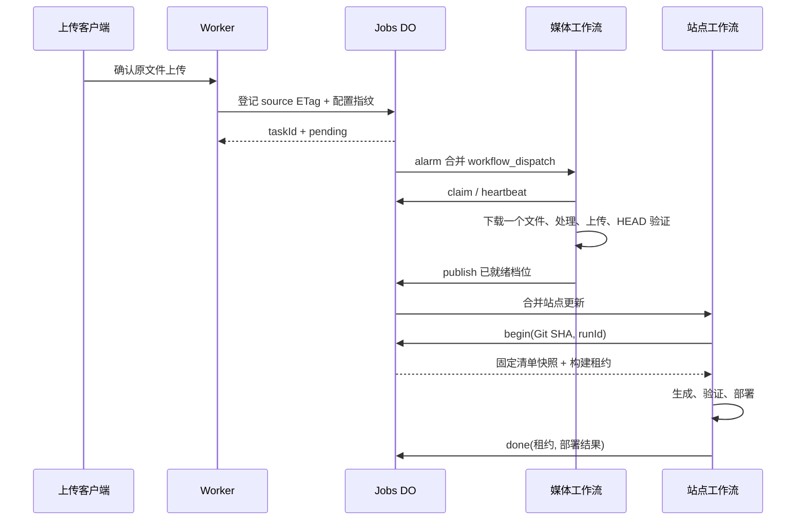

# Mosaic 架构

内容存于 Git，原文件与处理产物存于 R2；Node.js / EJS 生成静态站点，Hono Worker 提供内容、上传、统计与任务接口。前台和后台保持原生 ES Module，无框架迁移。

## 模块边界

| 层 | 模块 | 职责 |
| --- | --- | --- |
| 共享契约 | `shared/config.mjs`、`shared/media-manifest.mjs` | 默认值、兼容映射、校验、媒体身份与配置指纹 |
| 站点 | `scripts/site/{posts,media,indexes,render,generate}.mjs` | Markdown 解析、清单映射、复用分类标签索引、缓存 EJS 模板、清空输出 |
| 媒体 | `scripts/media/{images,videos,audio}.mjs` | 隐私处理、压缩、波形和音乐元数据 |
| 媒体执行 | `scripts/media/{run,storage,process}.mjs` | 单文件下载、流式哈希、租约心跳、存储与进程管理 |
| Worker 服务 | `worker/src/services/` | GitHub 内容、配置、工作流、发布状态、媒体登记与引用保护 |
| Worker 路由 | `worker/src/routes/` | 鉴权、参数、响应与服务编排 |
| 后台 | `cloud-admin/js/{router,lifecycle,editor,upload,jobs,build}.js` | 路由、退出清理、编辑、上传、媒体任务和部署状态 |
| 视频前台 | `src/assets/js/video/{engine,controls,player,playlist,registry}.js` | HLS、控制面板、播放器、播放列表与实例管理 |

`StatsDurableObject` 的类名、绑定、命名空间与 v1 迁移保留。新增 `JobsDurableObject` 使用独立 JOBS 绑定和 `v2-media-jobs` 迁移；统计数据不会被新任务状态覆盖。

## 两条计算链路

```mermaid
sequenceDiagram
  participant U as 上传客户端
  participant W as Worker
  participant D as Jobs DO
  participant M as 媒体工作流
  participant S as 站点工作流
  U->>W: 确认原文件上传
  W->>D: 登记 source ETag + 配置指纹
  D-->>W: taskId + pending
  D->>M: alarm 合并 workflow_dispatch
  M->>D: claim / heartbeat
  M->>M: 下载一个文件、处理、上传、HEAD 验证
  M->>D: publish 已就绪档位
  D->>S: 合并站点更新
  S->>D: begin(Git SHA, runId)
  D-->>S: 固定清单快照 + 构建租约
  S->>S: 生成、验证、部署
  S->>D: done(租约, 部署结果)
```

站点产物目录 `dist/` 每次清空。媒体工作目录位于系统临时目录或 `MEDIA_WORK_DIR`，不进入站点输出。`build-snapshot.json` 记录 Git SHA 与清单版本；模板、分类和标签索引在一次生成中复用。

## 任务与发布

任务状态为 pending、running、ready、failed、cancelled、superseded。上传登记在 R2 清单写入前先写 DO 存储；R2 或 GitHub 暂时不可用时，持久化 outbox 由 alarm 重试。租约到期进入有限重试，超过默认三次重试后由后台手动重试。

DO 将每个任务、媒体项与构建记录分开存储，分页恢复；状态变更与 alarm 在同一事务登记。配置变更保存补处理游标，alarm 按可配置批大小核验并排队；中断后继续，未变的处理指纹保持幂等。首次生产站点构建要求完成媒体导入，避免清单为空时覆盖旧站。

源 ETag 或处理配置指纹变化会生成新的 generation 并撤销旧租约。旧产物保留在 `asset.published`，首次上传才产生占位。低档 MP4、HLS 分片、播放列表和海报全部验证后发布；新增档位使用新 master 对象，旧 master 保持不变。

`/api/build/done` 是旧后台兼容探针，不能确认部署。内部回调用独立 `PIPELINE_SECRET` 的 HMAC 签名与时间窗鉴权，媒体再检查 taskId/runId/token/generation。内容脏状态与媒体变更分开记录，媒体任务不会使文章列表退回 N+1 次 GitHub 正文读取。

## 存储契约

- `originals/{slug}/{folder}/{filename}`：当前源文件。
- `processed/{slug}/{folder}/{generation}/...`：版本化产物。
- `site-data/media-manifest.json`：当前清单。
- `site-data/media-manifests/{revision}.json`：不可变发布快照。
- `site-data/posts-index.json`：部署后的精简列表缓存。
- `dist/data/posts.json`：保留一个兼容发布周期的完整旧入口。

清理保护当前有效清单、未完成任务断点、正在构建的快照和保留的成功部署。后台“处理缓存”操作改为重新排队，已有可用产物保留到引用释放与保留期结束。

现有 Pages IP 签名代理保持单一源文件及同步检查；目标域名必须通过 `API_TARGET` 配置。详见 [配置](configuration.md)、[迁移](migration.md)、[运维](operations.md)。

## 前台与后台请求边界

源码保持模块职责，发布阶段由 esbuild 将 app 依赖打包成一个 ESM 文件，消除串行模块下载。组件独立初始化；列表仍只读精简索引。视频使用显式跨域、按需分片、播放前布局占位与稳定媒体恢复键。后台 API 客户端管理在途请求、有限缓存、各消费者取消和超时；仪表盘按服务独立刷新。媒体列表由任务清单提供实际预览与显示顺序，不推断处理产物路径。

发布资源采用内容版本：前台 bundle 以 SHA-256 摘要命名并更新生成 HTML；后台保留原生模块，由 scripts/stage-admin.mjs 在部署暂存目录给整个依赖图添加一致版本。相同源码使用相同缓存键，改依赖使整套模块更新，避免新旧 API 客户端和页面混用。
